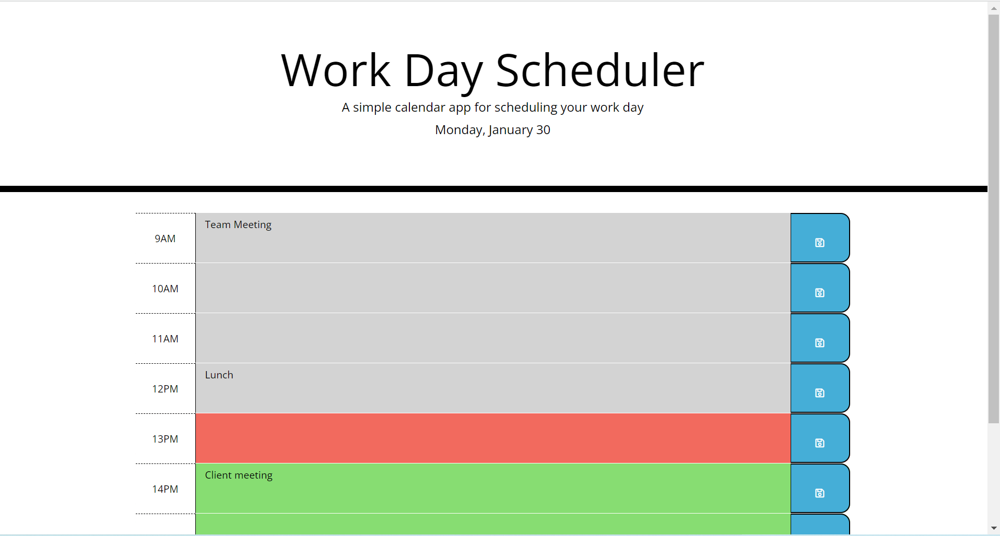

# Workday Planner

## Description

This simple calendar application allows a user to save events for each hour of their working day.
It uses jquery and moment.js libraries to manipulate the DOM, the date and time. 

## Installation

N/A

## Usage

Provide instructions and examples for use. Include screenshots as needed.

To add a screenshot, create an `assets/images` folder in your repository and upload your screenshot to it. Then, using the relative filepath, add it to your README using the following syntax:

    ```md
    
    ```

## Credits

N/A

## License

N/A